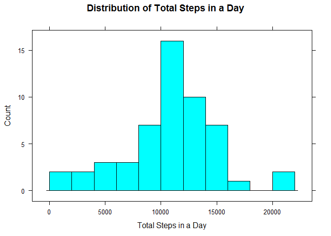
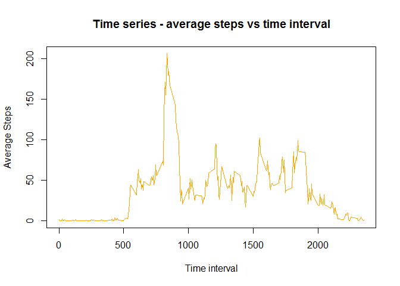
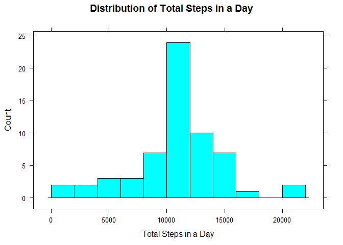
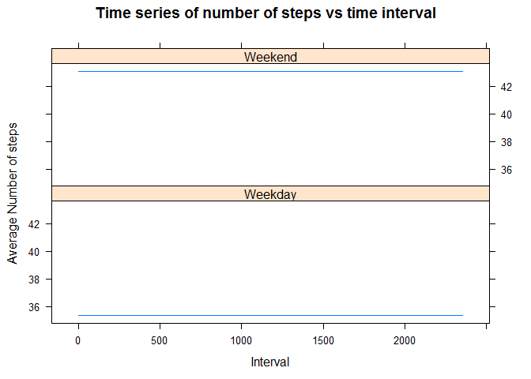

# Reproducible Research: Peer Assessment 1
Load all the required libraries

```r
library(data.table)
library(knitr)
library(lattice)
library(xtable)
```

Set echo=FALSE as Global option

```r
opts_chunk$set(eval = TRUE,echo=TRUE)
```


## Loading and preprocessing the data

```r
# check the data directory which holds the data files exists or not.
# If it doesn't exist create a directory with name 'data'
if (!file.exists("data"))
{
  dir.create("data")
}

#source url and the destination file url(current directory/data)
sourceUrl <- "http://d396qusza40orc.cloudfront.net/repdata%2Fdata%2Factivity.zip"
destinationUrl <- "./data/activity.zip"


# download the file & note the time
download.file(sourceUrl, destinationUrl,mode='wb')
fileDownloadedAt <- date()


#unzip the downloaded file
unzip(destinationUrl,"activity.csv")

# read the csv file using read.csv()  with header attribute equals to TRUE
activityData <- read.csv("activity.csv",header=TRUE);
```


## What is mean total number of steps taken per day?


```r
# find the NAs records index using complete.cases()
activityGoodDataIndex  <-  complete.cases(activityData)

# remove the NAs records data from the activity data
activityGoodData <- activityData[activityGoodDataIndex,]

# convert the data.frame to data.table
activityDT <- data.table(activityGoodData)

# add a new column "total_steps_in_a_day" with the sum of steps by date
activityDT <- activityDT[,total_steps_in_a_day:=sum(steps),by=date]

# subset the data with steps and date columns
steps_and_date_subset <- activityDT[,c(2,4),with=FALSE]

# fetch the unique rows from steps_and_date_subset 
steps_in_a_day <- unique(steps_and_date_subset,MARGIN=1)

# change the names for better readability
setnames(steps_in_a_day,"date","Day")
setnames(steps_in_a_day,"total_steps_in_a_day","Total_Steps")


# plot a histogram of the total number of steps taken each day using histogram() 
# from lattice plotting system
histogram(steps_in_a_day$Total_Steps,breaks = 10, 
          xlab = "Total Steps in a Day", 
          main = "Distribution of Total Steps in a Day",type="count")
```

 

```r
# mean of total steps 
meanOfTotalSteps <- mean(steps_in_a_day$Total_Steps)

# print meanOfTotalSteps
meanOfTotalSteps
```

```
## [1] 10766.19
```

```r
# median of total steps
medianOfTotalSteps <- median(steps_in_a_day$Total_Steps)

#print medianOfTotalSteps
medianOfTotalSteps
```

```
## [1] 10765
```

## What is the average daily activity pattern?

```r
# we'll re-use the activityDT data table

# add a new column "avg_steps_of_an_interval" with the sum of steps by date
activityDT <- activityDT[,avg_steps_of_an_interval:=mean(steps),by=interval]

# subset the data with interval and avg_steps_of_an_interval columns
interval_and_average_steps_subset <- activityDT[,c(3,5),with=FALSE]

# fetch the unique rows from interval_and_average_steps 
interval_and_average_steps <- unique(interval_and_average_steps_subset,MARGIN=1)

# change the names for better readability
setnames(interval_and_average_steps,"interval","Interval")
setnames(interval_and_average_steps,"avg_steps_of_an_interval","Average_Steps")

# plot the time series of Interval and Average Steps using 
# plot() of base plotting system
plot(interval_and_average_steps$Interval,interval_and_average_steps$Average_Steps,
     type="l",xlab = "Time interval",ylab = "Average Steps", 
       main = "Time series - average steps vs time interval",col="orange")
```

 

```r
#  Maximum Average steps of an interval 
maxAverageStepsIntervalSubset <- subset(interval_and_average_steps,Average_Steps==max(Average_Steps))

# Print the interval which has maximum average steps
maxAverageStepsIntervalSubset$Interval
```

```
## [1] 835
```


## Imputing missing values


```r
# number of missing values 
numberOfNAs <- length(activityData$steps[is.na(activityData$steps)])

numberOfNAs
```

[1] 2304

```r
# replace NAs in step column with  meanofTotalSteps in a day 
# we use activityData which is defined in ## Loading and preprocessing the data
# we use meanOfTotalSteps which is already calculated in ## What is mean total number of steps taken per day?

#activityData[!activityGoodDataIndex,1] = meanOfTotalSteps


# new activityDataset 

newActivityData <- activityData

# convert the data.frame to data.table
newActivityDT <- data.table(newActivityData)

# add a new column "total_steps_in_a_day" with the sum of steps by date
newActivityDT <- newActivityDT[,avg_steps_of_an_interval:=mean(steps,na.rm=TRUE),by=interval]


# replace NAs with mean_of_total_steps_in_a_day
newActivityDT$steps[is.na(newActivityDT$steps)] = newActivityDT$avg_steps_of_an_interval[is.na(newActivityDT$steps)]

# add a new column "total_steps_in_a_day" with the sum of steps by date
newActivityDT <- newActivityDT[,new_total_steps_in_a_day:=sum(steps),by=date]

# subset the data with steps and date columns
new_steps_and_date_subset <- newActivityDT[,c(2,5),with=FALSE]

# fetch the unique rows from steps_and_date_subset 
new_steps_in_a_day <- unique(new_steps_and_date_subset,MARGIN=1)

# change the names for better readability
setnames(new_steps_in_a_day,"date","Day")
setnames(new_steps_in_a_day,"new_total_steps_in_a_day","Total_Steps")


# plot a histogram of the total number of steps taken each day using histogram() 
# from lattice plotting system
histogram(new_steps_in_a_day$Total_Steps,breaks = 10,
          xlab = "Total Steps in a Day", 
          main = "Distribution of Total Steps in a Day",type="count")
```

 

```r
# mean of total steps 
newMeanOfTotalSteps <- mean(new_steps_in_a_day$Total_Steps)

# print meanOfTotalSteps
newMeanOfTotalSteps
```

[1] 10766.19

```r
# median of total steps
newMedianOfTotalSteps <- median(new_steps_in_a_day$Total_Steps)

#print medianOfTotalSteps
newMedianOfTotalSteps
```

[1] 10766.19

```r
oldValues <- c(meanOfTotalSteps, medianOfTotalSteps)
newValues <- c(newMeanOfTotalSteps, newMedianOfTotalSteps)
table <- data.frame(oldValues, newValues)
result <- apply(table, 1, function(x) abs(x[2]-x[1]))
table$absolutedifference <- result
rownames(table)<-c("mean", "median")
print(xtable(table), type="html")
```

<!-- html table generated in R 3.1.2 by xtable 1.7-4 package -->
<!-- Sat Feb 14 12:43:26 2015 -->
<table border=1>
<tr> <th>  </th> <th> oldValues </th> <th> newValues </th> <th> absolutedifference </th>  </tr>
  <tr> <td align="right"> mean </td> <td align="right"> 10766.19 </td> <td align="right"> 10766.19 </td> <td align="right"> 0.00 </td> </tr>
  <tr> <td align="right"> median </td> <td align="right"> 10765.00 </td> <td align="right"> 10766.19 </td> <td align="right"> 1.19 </td> </tr>
   </table>


## Are there differences in activity patterns between weekdays and weekends?


```r
# change the class of date column of activityData which was 
# defined in  ## Loading and preprocessing the data

activityData$date = as.Date(activityData$date)

# add dayname column which gives the name of the day ie (Monday, ... Sunday)
dayname = weekdays(activityData$date)

# vector with weekend daynames
weekendDays <- c("Saturday", "Sunday")

# logical vector which gives the weekends
isWeekend <- dayname %in% weekendDays


# add new column which gives the dayType ie. either weekend or weekday
activityData$dayType = factor(isWeekend,labels = c("Weekday","Weekend"))

# convert the data.frame to data.table
activityDT <- data.table(activityData)

# add a new column "total_steps_in_a_day" with the sum of steps by date
activityDT <- activityDT[,avg_steps_of_an_interval:=mean(steps,na.rm=TRUE),by=dayType]


# plot the time series
xyplot(activityDT$avg_steps_of_an_interval ~ activityDT$interval | activityDT$dayType, layout = c(1,2), type = "l", 
       xlab = "Interval", ylab = "Average Number of steps", main = "Time series of number of steps vs time interval" )
```

 
